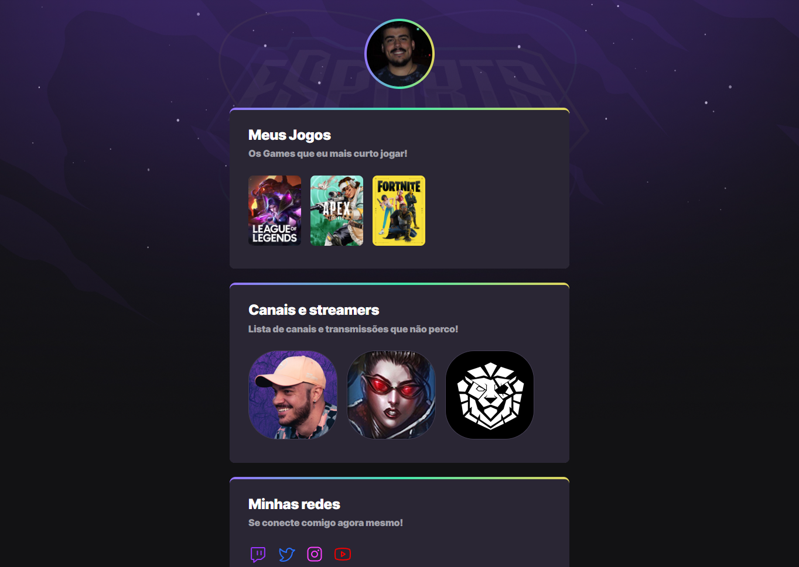

# NLW eSports - 

> Trilha Explorer

Projeto construído do evento Next Level Week da Rocketseat.

[🔗Clique aqui para acessar] (https://burilum.github.io/nlw-esports/)

## 🚀 Tecnologias

- HTML
- CSS
- Git e Github

## O que aprendi
Neste projeto tive meu primeiro contato com a linguagem CSS, em prática tive a lição de entender como funciona o ambiente de Codar (hehe) e como cada ponto pode alterar todo um trabalho de horas, com ele teve erros e acertos, porém, com cada alteração o aprendizado se fortalecia, foi uma experiência incrível e acrescentou muito em meu profissional e pessoal. Que venha mais conhecimento!

## 💜 Contato
murilogarcia97@hotmail.com